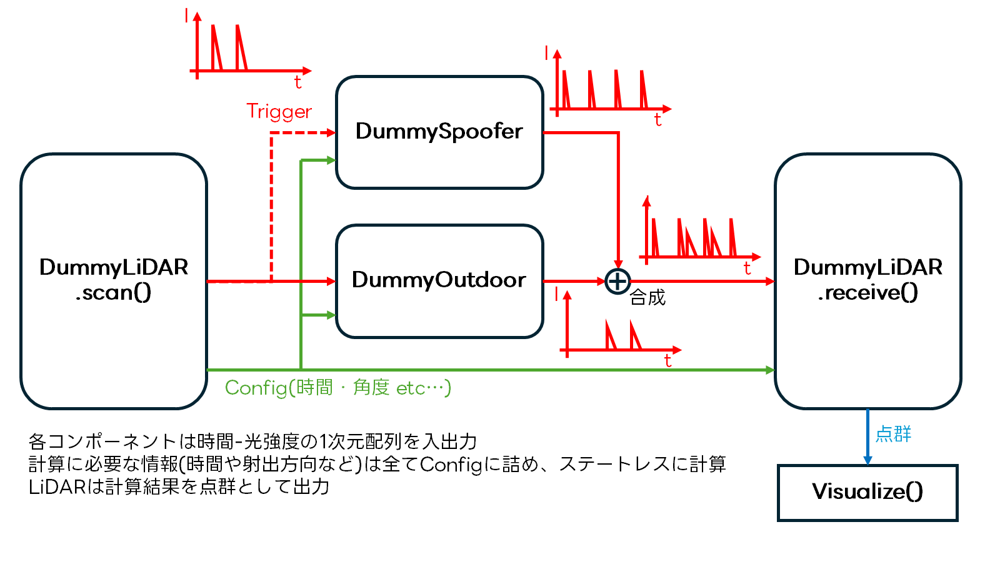

# SPAAL v2

**ソニーの機密情報を含んでいるのでソースコードの外部共有禁止**

* Simulator of the Physical Attack Against LiDARsの略
* Spoofing AttackとLiDARのToF信号処理をシミュレーションします

# 仕組み

* ToF距離計算に用いられる光を時間-強度の1次元データとしてモデル化
* LiDARの測距ごとに反射波形とその時間の攻撃波形をシミュレート、合成波形からToFを計算

# Getting Started

1. [poetry](https://python-poetry.org/)をインストール
2. `git clone git@github.com:Keio-CSG/spaal2.git`
3. `cd spaal2`
4. `poetry install`
5. `poetry run python main.py`
